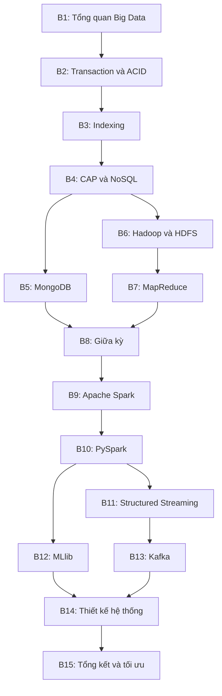

# KHUNG SOẠN NỘI DUNG HỌC PHẦN NHẬP MÔN DỮ LIỆU LỚN

## 1. Mục đích của tài liệu

Tài liệu này là bản phân rã công việc để nhiều người hoặc nhiều AI có thể soạn đồng thời nội dung cho 15 buổi của học phần **Nhập môn dữ liệu lớn** mà vẫn thống nhất về thuật ngữ, độ sâu, ví dụ, công cụ và chuẩn đầu ra.

Mỗi buổi chuyên môn cần tạo tối thiểu hai sản phẩm độc lập:

1. **Khung nội dung slide:** cấu trúc từng cụm slide, thông điệp chính, ví dụ, câu hỏi tương tác và mã Mermaid cần dùng. Đây chưa phải tệp trình chiếu hoàn chỉnh.
2. **Tài liệu đọc cho sinh viên:** nội dung hoàn chỉnh có thể phát trực tiếp cho sinh viên đọc, không chứa lời nhắc cho người soạn, chỉ dẫn cho AI, ghi chú hậu trường hoặc các cụm từ như “cần bổ sung”, “hãy viết”, “gợi ý người làm slide”.

Các buổi có thao tác kỹ thuật cần thêm:

3. **Nội dung thực hành tích hợp trên lớp:** bối cảnh, dữ liệu đầu vào, môi trường, nhiệm vụ, lệnh hoặc mã nguồn mẫu, kết quả mong đợi, câu hỏi phân tích và tiêu chí hoàn thành.

> Lưu ý về đề cương: học phần có 45 tiết lý thuyết và không có tín chỉ thực hành riêng. Vì vậy, các hoạt động kỹ thuật trong khung này được gọi là **thực hành tích hợp trên lớp**, nằm trong thời lượng 3 tiết của từng buổi.

## 2. Quy ước chung cho toàn bộ học phần

### 2.1. Đối tượng và mức độ

- Sinh viên năm thứ ba ngành Khoa học máy tính, đã có kiến thức lập trình và cơ sở dữ liệu quan hệ ở mức cơ bản.
- Nội dung ưu tiên khả năng giải thích, lựa chọn công nghệ và xây dựng luồng xử lý dữ liệu; không biến học phần thành khóa quản trị hệ thống chuyên sâu.
- HDFS và MapReduce được trình bày như nền tảng giúp hiểu tư duy lưu trữ, xử lý phân tán. Thực hành triển khai dùng Docker hoặc môi trường dựng sẵn để giảm thời gian cấu hình thủ công.
- Spark, PySpark, Kafka, xử lý luồng và thiết kế data pipeline là phần gắn nhiều hơn với kỹ năng nghề nghiệp hiện nay.

### 2.2. Tình huống xuyên suốt

Các buổi dùng chung một tình huống giả định mang tên **RetailStream**: hệ thống bán lẻ đa kênh phát sinh đơn hàng, danh mục sản phẩm, nhật ký truy cập và sự kiện tương tác theo thời gian thực.

Các nhóm dữ liệu thống nhất:

- `orders`: đơn hàng và trạng thái thanh toán;
- `order_items`: các mặt hàng trong đơn;
- `products`: danh mục sản phẩm có thuộc tính thay đổi;
- `customers`: thông tin khách hàng đã ẩn danh;
- `web_logs`: nhật ký truy cập dạng văn bản hoặc JSON Lines;
- `clickstream`: sự kiện xem sản phẩm, thêm vào giỏ, đặt hàng;
- `product_events`: sự kiện cập nhật giá và tồn kho.

Không bắt buộc mọi buổi đều dùng RetailStream. WordCount có thể xuất hiện để giải thích thuật toán, nhưng bài tập chính nên quay lại dữ liệu nhật ký hoặc sự kiện bán lẻ để duy trì mạch học tập.

### 2.3. Cấu trúc bắt buộc của khung slide mỗi buổi

Mỗi khung slide nên tương ứng khoảng 25–35 slide cho một buổi 3 tiết, được chia thành các cụm:

1. Vấn đề mở đầu hoặc tình huống thực tế.
2. Mục tiêu học tập của buổi.
3. Khái niệm và thuật ngữ cốt lõi.
4. Cơ chế hoạt động hoặc kiến trúc.
5. Ví dụ xuyên suốt.
6. So sánh, đánh đổi và trường hợp sử dụng.
7. Hoạt động phân tích hoặc thực hành tích hợp.
8. Sai lầm thường gặp.
9. Tóm tắt bằng 3–5 ý chính.
10. Câu hỏi tự kiểm tra và nội dung đọc tiếp.

Khung slide phải ghi rõ cho từng cụm: mục tiêu truyền đạt, nội dung chính, hình/bảng/sơ đồ cần có và thời lượng dự kiến. Không viết toàn bộ slide thành các đoạn văn dài.

### 2.4. Cấu trúc bắt buộc của tài liệu đọc mỗi buổi

Tài liệu đọc là văn bản cuối dành cho sinh viên và cần có:

1. Tên bài và mục tiêu học tập.
2. Tình huống dẫn nhập.
3. Nội dung lý thuyết theo các đề mục rõ ràng.
4. Ví dụ có dữ liệu hoặc luồng xử lý cụ thể.
5. Ít nhất một sơ đồ Mermaid khi sơ đồ giúp hiểu kiến trúc, trình tự hoặc luồng dữ liệu.
6. Bảng so sánh khi có từ ba đối tượng hoặc nhiều tiêu chí cần đối chiếu.
7. Thuật ngữ chính kèm giải thích ngắn.
8. Sai lầm hoặc ngộ nhận thường gặp.
9. Tóm tắt cuối bài.
10. Câu hỏi tự kiểm tra có đáp án ngắn ở cuối tài liệu.
11. Tài liệu tham khảo và đường dẫn đọc thêm từ nguồn chính thức hoặc sách được chỉ định.

Tài liệu đọc không dùng cách diễn đạt hướng về người biên soạn như “ở đây cần giải thích”, “chèn hình”, “giảng viên nên”, “AI cần viết”. Các sơ đồ, bảng, ví dụ và nội dung giải thích phải xuất hiện ở dạng hoàn chỉnh.

### 2.5. Chuẩn cho nội dung thực hành tích hợp

Mỗi hoạt động thực hành phải nêu đủ:

- mục tiêu kỹ năng;
- bối cảnh nghiệp vụ;
- dữ liệu đầu vào và mô tả trường dữ liệu;
- môi trường chạy và phần mềm cần có;
- trạng thái ban đầu của hệ thống;
- các nhiệm vụ theo thứ tự;
- lệnh hoặc mã nguồn tối thiểu có thể chạy;
- kết quả mẫu hoặc đặc điểm của kết quả đúng;
- câu hỏi yêu cầu sinh viên giải thích kết quả, không chỉ chụp màn hình;
- lỗi phổ biến và cách nhận biết;
- sản phẩm phải nộp;
- tiêu chí hoàn thành.

Ưu tiên Docker Compose cho MongoDB, Hadoop, Spark và Kafka; ưu tiên notebook hoặc tệp Python có cấu hình tập trung cho PySpark. Các bài PySpark có thể bắt đầu bằng `local[*]` trên Google Colab hoặc máy cá nhân để học API, nhưng trước khi kết thúc phần Spark, sinh viên bắt buộc chạy ít nhất một ứng dụng hoàn chỉnh trên cụm Spark Standalone gồm một master và tối thiểu hai worker. Không yêu cầu sinh viên cài lại các thư viện đã có sẵn trong môi trường học tập.

### 2.6. Quy ước sơ đồ Mermaid

- `flowchart` cho kiến trúc và luồng dữ liệu;
- `sequenceDiagram` cho giao dịch, producer–broker–consumer và trình tự xử lý;
- `stateDiagram-v2` cho trạng thái giao dịch hoặc trạng thái job;
- `erDiagram` cho mô hình dữ liệu quan hệ;
- mỗi sơ đồ chỉ thể hiện một thông điệp chính, ưu tiên tối đa 8–10 nút;
- tên nút ngắn, thuật ngữ được giải thích trong phần văn bản ngay sau sơ đồ.

### 2.7. Liên kết chuẩn đầu ra

- **CLO1:** phân tích Transaction, ACID, Indexing và giới hạn hệ phân tán qua CAP.
- **CLO2:** vận dụng MongoDB, HDFS và MapReduce trong lưu trữ, xử lý dữ liệu.
- **CLO3:** áp dụng PySpark, Spark Structured Streaming, MLlib và Kafka để thiết kế data pipeline.

### 2.8. Chuẩn bị và phân phối bộ dữ liệu thực hành

Toàn bộ học phần dùng một gói dữ liệu RetailStream có phiên bản cố định theo từng học kỳ. Người soạn nội dung phải chuẩn bị dữ liệu trước khi viết chi tiết các bài thực hành, không để từng buổi tự tạo một schema riêng.

#### Cấu trúc gói dữ liệu

```text
retailstream-data-v1/
├── README.md
├── LICENSE.txt
├── manifest.json
├── schemas/
│   ├── orders.schema.json
│   ├── products.schema.json
│   ├── web_logs.schema.json
│   └── clickstream.schema.json
├── sample/
│   ├── orders_sample.csv
│   ├── products_sample.json
│   ├── web_logs_sample.jsonl
│   └── clickstream_sample.jsonl
├── lab/
│   ├── orders.csv
│   ├── order_items.csv
│   ├── products.json
│   ├── web_logs.jsonl
│   └── clickstream.jsonl
├── cluster/
│   ├── orders/
│   ├── web_logs/
│   └── clickstream/
├── expected/
│   └── sample_expected_results.md
└── generators/
    ├── generate_retailstream.py
    └── requirements.txt
```

#### Ba mức dữ liệu

| Mức | Mục đích | Quy mô đề xuất | Định dạng |
|---|---|---:|---|
| `sample` | Đọc bằng mắt, theo dấu thuật toán và kiểm tra kết quả | 20–200 bản ghi mỗi bảng | CSV, JSON, JSON Lines |
| `lab` | Làm bài thực hành cá nhân trên Colab/máy cá nhân | 10.000–200.000 bản ghi tùy bảng | CSV, JSON Lines, Parquet |
| `cluster` | Quan sát partition, task, shuffle và nhiều worker | Từ vài trăm MB; có thể sinh thêm theo cấu hình máy | Parquet hoặc JSON Lines nén |

Không cố tạo dữ liệu nhiều GB nếu hạ tầng lớp không đủ. Mức `cluster` chỉ cần đủ lớn để job tồn tại đủ lâu cho sinh viên quan sát Spark UI và sự phân phối task.

#### Quy tắc định dạng

- Dữ liệu bảng phẳng như `orders` và `order_items` dùng CSV ở phần nhập môn, đồng thời cung cấp bản Parquet cho bài Spark.
- Dữ liệu có cấu trúc lồng như `products` dùng JSON.
- Nhật ký và sự kiện liên tục dùng JSON Lines, mỗi dòng là một sự kiện độc lập để thuận tiện cho HDFS, MapReduce, Kafka và Structured Streaming.
- Mọi timestamp dùng ISO 8601 và ghi rõ múi giờ.
- Mọi ID là giá trị giả lập; không sử dụng dữ liệu cá nhân thật.
- Các trường phân loại, giá trị thiếu, bản ghi trùng và bản ghi lỗi phải được tạo có chủ ý, mô tả trong README để phục vụ bài làm sạch dữ liệu.

#### Manifest và khả năng tái tạo

`manifest.json` phải ghi phiên bản dữ liệu, ngày tạo, seed, số bản ghi, schema version, kích thước và SHA-256 của từng tệp. Script sinh dữ liệu phải nhận tham số `--seed`, `--scale` và `--output-dir` để có thể tái tạo cùng một bộ dữ liệu hoặc tạo biến thể cho từng lớp.

Không đặt đáp án của bộ `lab` và `cluster` trong gói phát cho sinh viên. Chỉ công bố kết quả mẫu của bộ `sample`; giảng viên giữ riêng expected output và test kiểm tra cho các bộ lớn.

#### Cách phân phối

- Git/repository của học phần chỉ chứa README, schema, dữ liệu `sample`, script sinh dữ liệu, notebook khung và Docker Compose; không đưa tệp lớn vào lịch sử Git.
- Gói `lab` được phát dưới dạng tệp ZIP có phiên bản qua LMS hoặc kho tệp dùng chung của trường.
- Gói `cluster` được phát qua một đường dẫn tải ổn định hoặc được mount sẵn trên máy chủ/phòng máy; kèm checksum để kiểm tra tệp lỗi.
- Trong Docker, dữ liệu được mount chỉ đọc, ví dụ `./data:/opt/course/data:ro`. Với HDFS, sinh viên tải từ thư mục mount này lên namespace HDFS bằng lệnh trong bài.
- Mỗi bài thực hành phải ghi rõ tên phiên bản dữ liệu, đường dẫn tương đối và checksum cần dùng; không sử dụng đường dẫn tuyệt đối phụ thuộc máy người soạn.

### 2.9. Đánh giá bài thực hành trong bối cảnh có công cụ AI

Không dùng file code nộp cuối làm bằng chứng duy nhất về năng lực. Bài thực hành được đánh giá theo cả sản phẩm, quá trình và khả năng giải thích:

- 40%: kết quả đúng và có kiểm thử bằng dữ liệu nhỏ;
- 20%: minh chứng hệ thống chạy đúng môi trường, gồm log, Spark UI hoặc trạng thái cụm;
- 25%: sinh viên giải thích được luồng dữ liệu, cấu hình và kết quả;
- 15%: sửa trực tiếp một yêu cầu nhỏ hoặc xử lý một lỗi phát sinh khi demo.

Với bài nhóm, mã nguồn và hạ tầng có thể dùng chung nhưng mỗi sinh viên phải trả lời cá nhân một câu hỏi hoặc thực hiện một thay đổi ngắn. Ví dụ: đổi partition key, thêm một trường vào schema, sửa window, thay số reducer hoặc giải thích một stage có shuffle.

Công cụ AI có thể được cho phép trong quá trình học nếu sinh viên khai báo phần đã sử dụng và vẫn chịu trách nhiệm về mã nguồn. Trong kiểm tra tại lớp, quy định sử dụng thiết bị và AI phải được công bố rõ. Bài thi tự luận nên thực hiện trực tiếp trên giấy hoặc trên hệ thống khóa truy cập, dùng đoạn code đã cho để đọc, phân tích và sửa lỗi thay vì yêu cầu viết nhiều mã lặp lại.

## 3. Bản đồ nội dung và phụ thuộc giữa các buổi



## 4. Khung công việc cho từng buổi

## Buổi 1. Tổng quan quản lý và xử lý dữ liệu lớn

**Loại buổi:** Lý thuyết, thảo luận tình huống.  
**Đóng góp:** CLO1.

### Nội dung khung slide

- Dữ liệu lớn xuất hiện khi nào và vì sao hệ thống truyền thống gặp khó khăn.
- Phân biệt dữ liệu lớn với “một tệp có dung lượng lớn”.
- Các đặc trưng Volume, Velocity, Variety, Veracity, Value; chỉ ra giới hạn của mô hình 5V.
- Dữ liệu có cấu trúc, bán cấu trúc và phi cấu trúc.
- Xử lý theo lô, xử lý luồng và truy vấn tương tác.
- Scale up và scale out; hệ phân tán ở mức nhập môn.
- Vòng đời dữ liệu: phát sinh, thu nhận, lưu trữ, xử lý, phục vụ, quản trị.
- Bản đồ công nghệ toàn môn: RDBMS, MongoDB, HDFS, MapReduce, Spark, Kafka.
- Tình huống RetailStream và yêu cầu dữ liệu của từng bộ phận.
- Câu hỏi thảo luận: thời điểm nào chưa cần Big Data.

### Sơ đồ bắt buộc

- Luồng tổng quát từ nguồn dữ liệu đến ingestion, storage, processing và serving.
- Sơ đồ phân loại batch, streaming và interactive processing.

### Tài liệu đọc cần hoàn thiện

- Giải thích 5V bằng ví dụ định lượng và ví dụ nghiệp vụ.
- Phân biệt data warehouse, data lake và lakehouse ở mức khái niệm, không đi sâu triển khai.
- Nêu hai trường hợp dùng kiến trúc phân tán hợp lý và hai trường hợp RDBMS đơn lẻ vẫn phù hợp.
- Thuật ngữ: node, cluster, partition, replication, fault tolerance, throughput, latency.

### Hoạt động trên lớp

Phân tích bốn tình huống và quyết định có phải bài toán dữ liệu lớn hay không; sinh viên phải lập luận theo quy mô, tốc độ, loại dữ liệu, độ trễ và giá trị thay vì chỉ dựa vào dung lượng.

### Phạm vi không lặp lại

Không giải thích sâu CAP, HDFS, MapReduce, Spark hoặc Kafka; chỉ đặt chúng lên bản đồ tổng thể.

---

## Buổi 2. Cơ chế cơ sở dữ liệu và giao dịch

**Loại buổi:** Lý thuyết, bài tập phân tích.  
**Đóng góp:** CLO1.

### Nội dung khung slide

- Giao dịch là gì; ranh giới một giao dịch trong nghiệp vụ.
- Bốn thuộc tính ACID và mối liên hệ giữa chúng.
- Trạng thái giao dịch: active, partially committed, committed, failed, aborted.
- Lịch thực thi tuần tự và xen kẽ.
- Các bất thường: dirty read, non-repeatable read, phantom read, lost update.
- Isolation level và sự đánh đổi giữa nhất quán với khả năng đồng thời.
- Khóa, deadlock và vai trò của MVCC ở mức khái niệm.
- Commit, rollback và write-ahead logging ở mức nguyên lý.
- Tình huống đặt hàng–thanh toán–trừ tồn kho trong RetailStream.

### Sơ đồ bắt buộc

- `stateDiagram-v2` cho vòng đời giao dịch.
- `sequenceDiagram` cho giao dịch đặt hàng thành công và một nhánh rollback.

### Tài liệu đọc cần hoàn thiện

- Giải thích từng bất thường bằng hai giao dịch chạy xen kẽ.
- Bảng đối chiếu các isolation level và bất thường có thể xảy ra.
- Phân biệt tính nhất quán trong ACID với consistency trong CAP để chuẩn bị cho Buổi 4.
- Thuật ngữ: transaction, schedule, serializability, lock, deadlock, MVCC, commit, rollback.

### Bài tập trên lớp

Cho ba lịch thực thi của hai giao dịch; xác định bất thường, hậu quả nghiệp vụ và isolation level tối thiểu phù hợp.

### Phạm vi không lặp lại

Không trình bày chi tiết cấu trúc B-tree hoặc định lý CAP.

---

## Buổi 3. Kỹ thuật Indexing trong cơ sở dữ liệu

**Loại buổi:** Lý thuyết, bài tập truy vấn.  
**Đóng góp:** CLO1.

### Nội dung khung slide

- Vì sao quét toàn bảng chậm; mô hình chi phí I/O đơn giản.
- Cấu trúc B-tree/B+tree và cách tìm kiếm theo khóa.
- Clustered và non-clustered index ở mức khái niệm.
- Single-column, composite, unique và covering index.
- Quy tắc leftmost prefix cho chỉ mục ghép.
- Selectivity, cardinality và ảnh hưởng đến quyết định của optimizer.
- Đọc kế hoạch truy vấn: table scan, index scan, index seek.
- Chi phí của index đối với insert, update, delete và dung lượng lưu trữ.
- Trường hợp index không được sử dụng hoặc sử dụng không hiệu quả.

### Sơ đồ bắt buộc

- Cấu trúc nhiều tầng của B+tree từ root đến leaf.
- Luồng optimizer lựa chọn giữa full scan và index access.

### Tài liệu đọc cần hoàn thiện

- Ví dụ bảng `orders` với các truy vấn lọc theo khách hàng, trạng thái và thời gian.
- So sánh bốn phương án index cho cùng nhóm truy vấn.
- Một ví dụ `EXPLAIN` trước và sau khi tạo index; giải thích kết quả thay vì chỉ liệt kê lệnh.
- Thuật ngữ: page, node, root, leaf, selectivity, cardinality, query plan, covering index.

### Thực hành tích hợp trên lớp

- Dùng một RDBMS sẵn có với bảng `orders` đủ lớn để thấy khác biệt.
- Chạy truy vấn trước khi tạo index, đọc `EXPLAIN`, tạo index phù hợp và chạy lại.
- Sản phẩm: câu lệnh SQL, hai kế hoạch truy vấn và đoạn giải thích vì sao hiệu năng thay đổi.
- Tiêu chí hoàn thành: chọn đúng thứ tự cột cho ít nhất một composite index và chỉ ra một chi phí đánh đổi.

### Phạm vi không lặp lại

Không biến bài thành hướng dẫn tối ưu riêng cho một hệ quản trị cụ thể.

---

## Buổi 4. Định lý CAP và giới thiệu NoSQL

**Loại buổi:** Lý thuyết, thảo luận, Kiểm tra 1.  
**Đóng góp:** CLO1, CLO2.

### Nội dung khung slide

- Vì sao hệ phân tán có thể mất liên lạc giữa các nút.
- Ba thuộc tính Consistency, Availability, Partition tolerance theo CAP.
- Diễn giải đúng: khi xảy ra network partition, hệ thống phải đánh đổi C hoặc A.
- Phân biệt consistency trong CAP với ACID consistency.
- Strong consistency, eventual consistency và đọc dữ liệu cũ.
- Các họ NoSQL: key–value, document, wide-column, graph.
- Khi nào schema linh hoạt mang lại lợi ích và khi nào gây rủi ro.
- So sánh RDBMS và NoSQL theo mô hình dữ liệu, truy vấn, giao dịch, mở rộng và vận hành.
- Chọn loại cơ sở dữ liệu cho các thành phần RetailStream.

### Sơ đồ bắt buộc

- Hai node bị network partition và hai lựa chọn CP/AP.
- Cây quyết định chọn RDBMS hoặc một họ NoSQL dựa trên yêu cầu.

### Tài liệu đọc cần hoàn thiện

- Một kịch bản đặt hàng cần nhất quán mạnh và một kịch bản bộ đếm lượt xem chấp nhận eventual consistency.
- Làm rõ CAP không có nghĩa là một hệ thống luôn chỉ được chọn cố định hai chữ trong ba chữ.
- Bảng so sánh bốn họ NoSQL kèm ví dụ trường hợp sử dụng.
- Thuật ngữ: distributed system, partition, consistency, availability, eventual consistency, schema flexibility.

### Hoạt động trên lớp

Nhóm sinh viên nhận một yêu cầu hệ thống, xác định phần nào ưu tiên C, phần nào ưu tiên A và giải thích hành vi chấp nhận được khi mất kết nối mạng.

### Kiểm tra

Kiểm tra 1 trên LMS, trọng số 12,5%, đặt vào phần cuối buổi; nội dung bao quát Buổi 1–4.

---

## Buổi 5. Hệ quản trị MongoDB

**Loại buổi:** Lý thuyết có thực hành tích hợp.  
**Đóng góp:** CLO2.

### Nội dung khung slide

- Document, collection, BSON và `_id`.
- Thiết kế document theo cách ứng dụng truy cập dữ liệu.
- Embedding và referencing; kích thước, tần suất thay đổi và quan hệ dữ liệu.
- CRUD và toán tử truy vấn cốt lõi.
- Index trong MongoDB và liên hệ với Buổi 3.
- Aggregation Pipeline: `$match`, `$project`, `$unwind`, `$group`, `$sort`, `$lookup`.
- Atomicity ở mức document; giao dịch nhiều document ở mức giới thiệu.
- Replication và sharding chỉ ở mức bản đồ kiến trúc.

### Sơ đồ bắt buộc

- Mô hình document cho `products` có biến thể và thuộc tính linh hoạt.
- Luồng dữ liệu qua các stage của một aggregation pipeline.

### Tài liệu đọc cần hoàn thiện

- Hai phương án embedding/reference cho order và order items, kèm phân tích đánh đổi.
- Ví dụ CRUD và aggregation dùng dữ liệu RetailStream.
- Phân biệt aggregation pipeline với data pipeline toàn hệ thống.
- Thuật ngữ: BSON, document, collection, embedding, reference, pipeline stage, replica set, shard.

### Thực hành tích hợp trên lớp

- Môi trường: MongoDB bằng Docker Compose hoặc MongoDB Atlas đã chuẩn bị; `mongosh` hoặc MongoDB Compass.
- Dữ liệu: `products.json` và `orders.json`, mỗi tệp có mô tả trường.
- Nhiệm vụ: import dữ liệu; thực hiện CRUD; tạo một index; viết pipeline tính doanh thu theo danh mục và tháng; dùng `explain` cho một truy vấn.
- Sản phẩm: tệp truy vấn `.js` hoặc `.mongodb.js`, ảnh/kết quả chạy và phần giải thích embedding/reference.
- Tiêu chí hoàn thành: pipeline cho kết quả đúng, index phù hợp với truy vấn và giải thích được ít nhất một đánh đổi thiết kế.

---

## Buổi 6. Hệ sinh thái Hadoop và HDFS

**Loại buổi:** Lý thuyết có minh họa/thực hành tích hợp.  
**Đóng góp:** CLO2.

### Nội dung khung slide

- Bối cảnh ra đời của Hadoop và vai trò lịch sử trong Big Data.
- Phân biệt Hadoop, HDFS, YARN và MapReduce.
- NameNode, DataNode, client và metadata.
- Block storage, replication factor và rack awareness ở mức khái niệm.
- Quy trình đọc tệp và ghi tệp.
- Heartbeat, block report và xử lý DataNode lỗi.
- Small files problem; HDFS phù hợp và không phù hợp với loại tải nào.
- High availability và checkpoint/secondary NameNode; sửa ngộ nhận Secondary NameNode là NameNode dự phòng.
- Vị trí hiện nay của HDFS so với object storage và cloud data lake ở mức định hướng.

### Sơ đồ bắt buộc

- Kiến trúc NameNode–DataNode–client.
- `sequenceDiagram` cho quy trình ghi một tệp nhiều block có replication.
- Tình huống một DataNode lỗi và quá trình tái sao chép block.

### Tài liệu đọc cần hoàn thiện

- Ví dụ chia một tệp thành block và phân phối bản sao trên các DataNode.
- Bảng so sánh HDFS, local file system và object storage theo namespace, truy cập, độ bền, độ trễ và trường hợp sử dụng.
- Phần triển khai HDFS bằng Docker giải thích vai trò từng container, volume dữ liệu, network nội bộ và các cổng Web UI; không mô tả Docker như nhiều máy vật lý thật.
- Thuật ngữ: block, replication, metadata, heartbeat, block report, rack awareness, high availability.

### Gói cài đặt Docker bắt buộc

Người soạn bài phải cung cấp một gói đã kiểm thử, không chỉ ghi chung chung “cài Hadoop”. Gói tối thiểu gồm:

```text
06_hdfs_docker/
├── README.md
├── .env.example
├── docker-compose.yml
├── healthcheck/
├── scripts/
│   ├── start-cluster.sh
│   ├── start-cluster.ps1
│   ├── stop-cluster.sh
│   ├── stop-cluster.ps1
│   ├── reset-lab.sh
│   ├── reset-lab.ps1
│   ├── load-sample-data.sh
│   └── load-sample-data.ps1
└── data/
    └── web_logs_sample.jsonl
```

`docker-compose.yml` phải có tối thiểu một NameNode và hai DataNode. Nếu Buổi 7 chạy MapReduce trên YARN, cùng gói hoặc một profile mở rộng phải có ResourceManager, tối thiểu hai NodeManager và HistoryServer khi cần quan sát lịch sử job.

README phải trình bày đầy đủ:

1. Yêu cầu Docker Desktop hoặc Docker Engine và tài nguyên tối thiểu.
2. Bảng phiên bản image Hadoop, Java và kiến trúc CPU đã kiểm thử; các image phải được ghim phiên bản, không dùng `latest`.
3. Cách sao chép `.env.example` thành `.env` và ý nghĩa các biến cấu hình.
4. Lệnh khởi động, kiểm tra health, xem log và dừng cụm.
5. Địa chỉ NameNode Web UI, ResourceManager Web UI và HistoryServer nếu có.
6. Lệnh tạo thư mục HDFS, upload, list, đọc, tải xuống, xóa và chạy `fsck`.
7. Cách kiểm tra replication và quan sát DataNode mất kết nối.
8. Cách đặt lại môi trường thực hành mà không xóa nhầm dữ liệu ngoài thư mục lab.
9. Mục lỗi thường gặp trên Windows, macOS và Linux: cổng bị chiếm, thiếu RAM, volume permission, line ending và khác biệt kiến trúc CPU.
10. Kết quả mong đợi sau mỗi bước để sinh viên tự đối chiếu.

Gói phải được chạy thử trên ít nhất một máy sạch trước khi phát. Sinh viên không phải tự cấu hình NameNode/DataNode từ đầu; mục tiêu là sử dụng và quan sát cụm, còn cấu hình thủ công được giải thích ở mức khái niệm.

### Thực hành tích hợp trên lớp

- Môi trường: cụm Hadoop Docker Compose đã cấu hình tương thích; sinh viên khởi động bằng hướng dẫn được cung cấp thay vì cài thủ công từng dịch vụ.
- Dữ liệu: `retailstream-data-v1/sample/web_logs_sample.jsonl` để đối chiếu bằng mắt và `retailstream-data-v1/cluster/web_logs/` để quan sát nhiều block. Nếu máy lớp học hạn chế tài nguyên, có thể dùng bộ `lab` cùng block size giáo dục nhỏ hơn; tài liệu phải nói rõ đây không phải cấu hình production mặc định.
- Nhiệm vụ: khởi động cụm; kiểm tra health và Web UI; tạo thư mục HDFS; đưa `web_logs` lên HDFS; xem block và replication; đọc/tải tệp; dừng một DataNode trong môi trường thử nghiệm; khởi động lại và quan sát trạng thái.
- Sản phẩm: nhật ký lệnh, ảnh/trích xuất Web UI, kết quả `fsck` hoặc thông tin block và phần giải thích điều xảy ra khi node dừng.
- Tiêu chí hoàn thành: cụm có một NameNode và tối thiểu hai DataNode hoạt động; sinh viên phân biệt được dữ liệu thật với metadata, xác định được vị trí các bản sao block và giải thích được cơ chế chịu lỗi.

---

## Buổi 7. Mô hình xử lý MapReduce

**Loại buổi:** Lý thuyết có bài tập thuật toán và thực hành tích hợp.  
**Đóng góp:** CLO2.

### Nội dung khung slide

- Tư duy chia để trị và xử lý gần nơi lưu dữ liệu.
- Input split, record reader, Mapper, Combiner, Partitioner, Shuffle, Sort, Reducer và Output.
- Cặp key–value qua từng giai đoạn.
- WordCount như ví dụ tối giản.
- Ví dụ chính: đếm lượt truy cập theo sản phẩm từ `web_logs`.
- Data locality, parallelism và tác động của shuffle.
- Combiner không phải Reducer thu nhỏ; điều kiện sử dụng an toàn.
- Skew, straggler và dữ liệu trung gian lớn.
- Giới hạn của MapReduce với xử lý lặp và truy vấn tương tác.

### Sơ đồ bắt buộc

- Luồng đầy đủ Map → local combine → partition → shuffle/sort → Reduce.
- Phân phối key từ nhiều mapper đến reducer tương ứng.

### Tài liệu đọc cần hoàn thiện

- Theo dấu một tập dữ liệu nhỏ qua từng bước, hiển thị chính xác key–value trung gian.
- Pseudocode cho WordCount và thống kê lượt xem theo sản phẩm.
- Ví dụ về một combiner sai để sinh viên thấy vì sao phép toán phải phù hợp.
- Thuật ngữ: input split, mapper, combiner, partitioner, shuffle, sort, reducer, data locality, skew.

### Thực hành tích hợp trên lớp

- Nhiệm vụ 1: viết pseudocode mapper/reducer cho dữ liệu nhật ký.
- Nhiệm vụ 2: chạy Hadoop Streaming hoặc job mẫu trên cụm dựng sẵn.
- Nhiệm vụ 3: thay đổi số reducer và quan sát số tệp đầu ra.
- Sản phẩm: pseudocode, mã mapper/reducer, kết quả tổng hợp và giải thích vai trò shuffle.
- Tiêu chí hoàn thành: key–value đúng ở mọi giai đoạn và kết quả cuối khớp dữ liệu kiểm thử nhỏ.

---

## Buổi 8. Kiểm tra giữa kỳ

**Loại buổi:** Đánh giá giữa kỳ, 3 tiết.  
**Đóng góp:** CLO1, CLO2.  
**Trọng số:** 25%.

### Công việc cần chuẩn bị

- Ma trận đề bám CLO1 và CLO2, bao quát Buổi 1–7.
- Cấu trúc gồm phần trắc nghiệm và tự luận/phân tích luồng.
- Câu hỏi không chỉ kiểm tra ghi nhớ thuật ngữ; phải có tình huống giao dịch, lựa chọn index, phân tích CAP, mô hình MongoDB hoặc theo dấu MapReduce.
- Đáp án, thang điểm chi tiết và tiêu chí chấp nhận các cách giải tương đương.
- Hai mã đề tương đương về độ khó nếu tổ chức thi trực tiếp.
- Bộ dữ liệu nhỏ hoặc bảng dữ liệu phải được in ngay trong đề nếu câu hỏi cần tính toán.

### Phân bổ nội dung đề đề xuất

- 40%: Transaction, ACID, isolation, indexing và phân tích giới hạn hệ thống — CLO1.
- 20%: CAP, lựa chọn RDBMS/NoSQL và mô hình MongoDB — CLO1, CLO2.
- 40%: HDFS và MapReduce — CLO2.

### Mẫu phần tự luận giữa kỳ

Phần tự luận đề xuất 10 điểm, thực hiện trực tiếp trong lớp. Mỗi câu dùng một biến thể dữ liệu hoặc tham số khác nhau giữa các mã đề.

| Câu | Ý tưởng đề bài | Điểm | CLO | Minh chứng năng lực |
|---|---|---:|---|---|
| 1 | Hai giao dịch đăng ký cùng suất cuối của một lớp học phần chạy xen kẽ. Xác định bất thường, hậu quả và isolation level/cơ chế phù hợp. | 2,0 | CLO1 | Phân tích transaction và ACID trong tình huống cụ thể |
| 2 | Cho bảng `registrations` và ba truy vấn phổ biến. Chọn một hoặc hai index, giải thích thứ tự cột và nêu chi phí khi ghi dữ liệu. | 1,5 | CLO1 | Vận dụng indexing thay vì chỉ định nghĩa |
| 3 | Hệ thống đăng ký học phần có hai trung tâm dữ liệu bị network partition. Phân tích phần nào ưu tiên C, phần nào có thể ưu tiên A; không được trả lời chỉ bằng nhãn “CP/AP”. | 1,5 | CLO1 | Phân tích đúng CAP và đánh đổi |
| 4 | Cho dữ liệu môn học có thuộc tính thay đổi theo từng khoa. Đề xuất document MongoDB, lựa chọn embedding/reference và viết một aggregation pipeline ở dạng lệnh hoặc pseudocode. | 1,5 | CLO2 | Vận dụng mô hình document và truy vấn |
| 5 | Một tệp được chia thành các block với replication factor cho trước trên ba DataNode. Vẽ phân bố bản sao, phân tích khi một DataNode lỗi và chỉ ra vai trò NameNode. | 1,5 | CLO2 | Giải thích HDFS và fault tolerance |
| 6 | Cho 8–12 dòng log đăng ký học phần. Viết Mapper/Reducer hoặc theo dấu key–value qua Map, Shuffle/Sort và Reduce để thống kê số lượt đăng ký theo khoa. | 2,0 | CLO2 | Vận dụng MapReduce và theo dấu dữ liệu |

### Nguyên tắc chấm phần tự luận giữa kỳ

- Mỗi câu có rubric theo các bước lập luận, không chấm chỉ dựa vào đáp số cuối.
- Chấp nhận phương án khác đáp án mẫu nếu thỏa yêu cầu và phân tích đúng đánh đổi.
- Lỗi thuật ngữ làm thay đổi bản chất, như nhầm Secondary NameNode với NameNode dự phòng hoặc nhầm ACID consistency với CAP consistency, phải bị trừ tại tiêu chí tương ứng.
- Câu có code chỉ yêu cầu đoạn lệnh/pseudocode trọng tâm; không yêu cầu nhớ boilerplate hoặc cú pháp cài đặt.
- Có ít nhất hai mã đề thay số liệu, lịch giao dịch, câu truy vấn, document và key phân vùng; độ khó và rubric giữ tương đương.

### Tài liệu dành cho sinh viên

Chỉ phát phạm vi ôn tập, dạng câu hỏi, một câu mẫu khác dữ liệu và quy định làm bài; không phát ma trận đáp án hoặc các chỉ dấu làm lộ câu hỏi. Phần tự luận nên làm trên giấy hoặc thiết bị được khóa truy cập để đo khả năng phân tích độc lập.

---

## Buổi 9. Giới thiệu Apache Spark

**Loại buổi:** Lý thuyết có minh họa.  
**Đóng góp:** CLO3.

### Nội dung khung slide

- Vấn đề của chuỗi job MapReduce và nhu cầu xử lý lặp/tương tác.
- Kiến trúc Spark: driver, cluster manager, executor, application, job, stage, task.
- RDD: partition, lineage, transformation và action.
- Lazy evaluation và cách tạo DAG.
- Narrow transformation và wide transformation; khi nào phát sinh shuffle.
- Cache/persist và khả năng khôi phục từ lineage.
- Spark không đồng nghĩa mọi dữ liệu luôn nằm trong RAM.
- RDD, DataFrame và Spark SQL: vị trí và mức trừu tượng.
- Phân biệt chế độ `local[*]` với Spark Standalone Cluster.
- Chế độ standalone, YARN và Kubernetes ở mức khái niệm; thực hành cụm dùng Spark Standalone trên Docker.

### Sơ đồ bắt buộc

- Kiến trúc driver–executor.
- Cụm Docker gồm Jupyter hoặc `spark-submit`, một Spark Master và tối thiểu hai Spark Worker.
- DAG được chia thành stage tại ranh giới shuffle.
- So sánh luồng nhiều job MapReduce với một DAG Spark.

### Tài liệu đọc cần hoàn thiện

- Theo dấu một chuỗi transformation đến action đầu tiên.
- Giải thích lineage vừa hỗ trợ tối ưu vừa hỗ trợ phục hồi lỗi như thế nào.
- Bảng đối chiếu MapReduce và Spark theo mô hình thực thi, dữ liệu trung gian, độ trễ và trường hợp sử dụng.
- Thuật ngữ: driver, executor, job, stage, task, partition, lineage, lazy evaluation, shuffle, cache.

### Hoạt động trên lớp

Cho một đoạn PySpark ngắn chưa thực thi action; sinh viên dự đoán khi nào job chạy, DAG có bao nhiêu nhánh rộng và vị trí có thể phát sinh shuffle. Giảng viên demo cụm Spark Docker `1 Master + 2 Worker`, mở Spark UI và chỉ ra application, executor, job, stage và task để chuẩn bị cho bài chạy cụm bắt buộc ở Buổi 12.

---

## Buổi 10. Lập trình dữ liệu lớn với PySpark

**Loại buổi:** Lý thuyết có thực hành tích hợp trọng tâm.  
**Đóng góp:** CLO3.

### Nội dung khung slide

- SparkSession và vòng đời một ứng dụng PySpark.
- Đọc CSV, JSON, Parquet; schema inference và explicit schema.
- DataFrame transformation: select, filter, withColumn, groupBy, join.
- Spark SQL và temporary view.
- Null, kiểu dữ liệu, timestamp và làm sạch dữ liệu.
- Built-in functions so với Python UDF.
- Partition, repartition, coalesce và shuffle.
- Đọc logical/physical plan bằng `explain` ở mức nhập môn.
- Ghi dữ liệu có partition và lựa chọn định dạng cột Parquet.

### Sơ đồ bắt buộc

- Luồng đọc dữ liệu → chuẩn hóa → join → tổng hợp → ghi Parquet.
- Quan hệ giữa mã DataFrame, logical plan và physical execution.

### Tài liệu đọc cần hoàn thiện

- Một notebook/tệp Python hoàn chỉnh xử lý `orders`, `order_items` và `products`.
- Giải thích từng phép biến đổi và tác động đến schema.
- Ví dụ một lỗi join gây nhân bản bản ghi và cách phát hiện.
- Thuật ngữ: SparkSession, schema, transformation, action, Catalyst, logical plan, physical plan, partition, UDF.

### Thực hành tích hợp trên lớp

- Môi trường: giai đoạn đầu chạy PySpark `local[*]` trên Colab hoặc máy cá nhân; notebook/tệp Python có khối cấu hình tập trung để có thể chuyển sang `spark://spark-master:7077` mà không sửa logic xử lý.
- Nhiệm vụ: đọc ba nguồn dữ liệu; khai báo schema; làm sạch; join; tính doanh thu theo tháng và danh mục; lưu Parquet partition theo tháng; đọc `explain`.
- Sản phẩm: notebook hoặc `.py`, dữ liệu đầu ra và phần trả lời câu hỏi về shuffle/partition.
- Tiêu chí hoàn thành: schema đúng, không nhân bản sai khi join, chỉ số tổng hợp được kiểm tra với một mẫu dữ liệu nhỏ.

---

## Buổi 11. Xử lý dữ liệu luồng với Spark Structured Streaming

**Loại buổi:** Lý thuyết có thực hành tích hợp.  
**Đóng góp:** CLO3.

### Nội dung khung slide

- Phân biệt event time, ingestion time và processing time.
- Mô hình bảng tăng dần của Structured Streaming.
- Micro-batch và continuous processing ở mức khái niệm; dùng đúng tên Structured Streaming.
- Source, transformation, sink và output mode.
- Stateless và stateful processing.
- Window, watermark và late data.
- Checkpoint, khả năng phục hồi và khái niệm end-to-end semantics.
- Complete, append và update mode.
- Streaming query lifecycle và quan sát tiến trình.

### Sơ đồ bắt buộc

- Dòng sự kiện đi qua source, windowed aggregation, state store và sink.
- Timeline minh họa event time, dữ liệu đến muộn và watermark.

### Tài liệu đọc cần hoàn thiện

- Ví dụ clickstream được tổng hợp theo cửa sổ thời gian.
- Giải thích dữ liệu đến muộn nào được chấp nhận và dữ liệu nào bị loại với một watermark cụ thể.
- Phân biệt xử lý gần thời gian thực với bảo đảm thời gian thực cứng.
- Thuật ngữ: event time, processing time, window, watermark, state, checkpoint, output mode, trigger.

### Thực hành tích hợp trên lớp

- Nguồn ban đầu: file stream hoặc socket để cô lập khái niệm; Kafka được ghép ở Buổi 13.
- Nhiệm vụ: đọc sự kiện JSON; parse schema; thống kê lượt xem theo cửa sổ; thêm watermark; ghi ra console hoặc memory sink; khởi động lại từ checkpoint.
- Sản phẩm: mã chạy được, ảnh/kết quả nhiều micro-batch và lời giải thích về late data.
- Tiêu chí hoàn thành: phân biệt đúng event time/processing time và chứng minh checkpoint được tái sử dụng.

---

## Buổi 12. Học máy phân tán với Spark MLlib

**Loại buổi:** Lý thuyết có thực hành tích hợp, Kiểm tra 2.  
**Đóng góp:** CLO3.

### Nội dung khung slide

- Khi nào cần học máy phân tán và khi nào pandas/scikit-learn đủ dùng.
- DataFrame-based Spark ML và khái niệm pipeline.
- Transformer, Estimator, Model và PipelineModel.
- Xử lý categorical feature, missing value, scale và VectorAssembler.
- Chia train/test và tránh rò rỉ dữ liệu.
- Mô hình phân loại hoặc hồi quy đơn giản phù hợp RetailStream.
- Evaluator và các metric cơ bản; không đánh đồng accuracy với chất lượng chung.
- CrossValidator/TrainValidationSplit ở mức giới thiệu và chi phí tính toán.
- Lưu, nạp và áp dụng PipelineModel.
- Cùng một pipeline MLlib khi chạy `local[*]` và khi chạy trên Spark Standalone Cluster.
- Phân phối partition, task và executor khi huấn luyện mô hình trên nhiều worker.
- Đọc Spark UI để xác nhận ứng dụng thực sự sử dụng cụm thay vì vô tình chạy local.

### Sơ đồ bắt buộc

- Pipeline từ dữ liệu thô qua preprocessing, vector hóa, mô hình và đánh giá.
- Phân biệt fit và transform qua các thành phần.
- Kiến trúc triển khai notebook hoặc `spark-submit` → Spark Master → hai hoặc nhiều Spark Worker.

### Tài liệu đọc cần hoàn thiện

- Ví dụ dự đoán đơn hàng có nguy cơ hủy hoặc phân loại hành vi khách hàng bằng dữ liệu đã ẩn danh.
- Giải thích vì sao mọi bước biến đổi phải được fit đúng trên tập huấn luyện khi cần.
- Bảng metric phù hợp cho phân loại mất cân bằng.
- Phân biệt mã nguồn ứng dụng với môi trường thực thi: logic MLlib giữ nguyên, cấu hình `master` thay đổi từ `local[*]` sang `spark://spark-master:7077`.
- Giải thích executor, partition, stage và task quan sát được khi pipeline chạy trên cụm.
- Thuật ngữ: feature, label, vector, transformer, estimator, pipeline, evaluator, data leakage.

### Thực hành tích hợp trên lớp

Thực hành được tổ chức thành hai giai đoạn và giai đoạn chạy cụm là bắt buộc:

1. **Giai đoạn 1 – chạy local:** sinh viên chạy pipeline bằng `local[*]` trên Google Colab hoặc máy cá nhân để chuẩn hóa dữ liệu, mã hóa biến phân loại, tạo feature vector, huấn luyện mô hình, đánh giá và lưu PipelineModel.
2. **Giai đoạn 2 – chạy trên cụm:** sinh viên chạy lại chính pipeline đó trên Spark Standalone Cluster bằng Docker Compose, gồm một Spark Master và tối thiểu hai Spark Worker. Ứng dụng phải kết nối tới `spark://spark-master:7077` hoặc địa chỉ master tương đương trong môi trường lớp học.

Các nhiệm vụ bắt buộc ở giai đoạn chạy cụm:

- khởi động và kiểm tra trạng thái của master cùng các worker;
- đưa dữ liệu vào vị trí mà mọi worker đều truy cập được;
- gửi ứng dụng bằng notebook kết nối cluster hoặc `spark-submit`;
- mở Spark UI, xác nhận ứng dụng có executor trên nhiều worker;
- ghi nhận job, stage, task và số partition của ít nhất một bước xử lý;
- dừng một worker trong môi trường thử nghiệm, quan sát trạng thái ứng dụng và giải thích giới hạn của thử nghiệm;
- so sánh kết quả mô hình giữa local và cluster; kết quả phải tương đương khi dùng cùng dữ liệu, seed và cấu hình.

**Sản phẩm:** notebook hoặc tệp Python dùng chung cho hai chế độ; tệp Docker Compose hoặc cấu hình cụm được cung cấp; lệnh chạy; metric và confusion matrix; ảnh Spark UI thể hiện master, tối thiểu hai worker và executor; phần giải thích ngắn về cách Spark phân phối công việc.

**Tiêu chí hoàn thành:** pipeline chạy đầu cuối ở cả `local[*]` và cluster; cluster có một master và tối thiểu hai worker hoạt động; Spark UI chứng minh job không chạy nhầm ở local mode; không để cột nhãn lọt vào feature; giải thích được ít nhất hai metric và mối quan hệ giữa partition, task, executor và worker. Không dùng thời gian chạy trên dữ liệu nhỏ để kết luận cluster luôn nhanh hơn local vì overhead truyền thông và lập lịch có thể làm cluster chậm hơn.

### Kiểm tra

Kiểm tra 2 trên LMS, trọng số 12,5%, bao quát Buổi 9–12; bố trí thời lượng riêng để không làm mất phần thực hành cốt lõi.

---

## Buổi 13. Message Queue và Event Streaming với Apache Kafka

**Loại buổi:** Lý thuyết có thực hành tích hợp.  
**Đóng góp:** CLO3.

### Nội dung khung slide

- Vấn đề ghép nối trực tiếp giữa producer và consumer.
- Message queue, publish/subscribe và event streaming.
- Kafka broker, topic, partition, offset, producer, consumer và consumer group.
- Phân phối partition trong consumer group.
- Thứ tự chỉ được bảo đảm trong phạm vi partition.
- Retention và khả năng đọc lại sự kiện.
- Replication, leader/follower ở mức khái niệm.
- Delivery semantics: at-most-once, at-least-once, exactly-once ở mức thận trọng.
- Khóa sự kiện và chiến lược partition.
- Tích hợp Kafka source với Spark Structured Streaming.

### Sơ đồ bắt buộc

- `sequenceDiagram` producer → broker/topic partition → consumer group.
- Phân bổ bốn partition cho hai consumer.
- Pipeline Kafka → Spark Structured Streaming → sink.

### Tài liệu đọc cần hoàn thiện

- Ví dụ sự kiện clickstream có key, value, timestamp và schema.
- Giải thích offset khác ID nghiệp vụ như thế nào.
- Một tình huống chọn key sai làm mất cân bằng partition.
- Phân biệt Kafka với cơ sở dữ liệu và với HDFS.
- Thuật ngữ: broker, topic, partition, offset, producer, consumer, consumer group, retention, acknowledgement.

### Thực hành tích hợp trên lớp

- Môi trường: Kafka bằng Docker Compose ở chế độ phù hợp phiên bản đã chọn; script producer và consumer mẫu.
- Nhiệm vụ: tạo topic nhiều partition; gửi sự kiện JSON; quan sát offset; chạy hai consumer cùng group; đổi key; nối Kafka với Structured Streaming và tổng hợp cửa sổ.
- Sản phẩm: cấu hình, mã producer/consumer hoặc notebook Spark, kết quả và sơ đồ luồng.
- Tiêu chí hoàn thành: giải thích được partition assignment, offset và ảnh hưởng của key đến thứ tự/phân phối.

---

## Buổi 14. Thiết kế hệ thống dữ liệu lớn

**Loại buổi:** Lý thuyết, bài tập thiết kế nhóm.  
**Đóng góp:** CLO3.

### Nội dung khung slide

- Chuyển yêu cầu nghiệp vụ thành yêu cầu dữ liệu và phi chức năng.
- Các lớp source, ingestion, storage, processing, serving, orchestration, observability và governance.
- Batch pipeline và streaming pipeline.
- Lambda Architecture: batch layer, speed layer, serving layer.
- Kappa Architecture và điều kiện phù hợp.
- Data lake, warehouse và lakehouse trong kiến trúc tổng thể.
- Chất lượng dữ liệu, schema evolution, idempotency và replay.
- Khả năng mở rộng, chịu lỗi, bảo mật, chi phí và độ phức tạp vận hành.
- Tránh chọn công nghệ trước khi xác định yêu cầu.

### Sơ đồ bắt buộc

- Lambda Architecture và Kappa Architecture ở hai sơ đồ riêng.
- Kiến trúc RetailStream đầu cuối không quá 10 khối chính.

### Tài liệu đọc cần hoàn thiện

- Một quy trình thiết kế từ yêu cầu đến kiến trúc.
- Ma trận quyết định batch/stream, latency, consistency, replay, volume và chi phí.
- Phân tích một phương án over-engineering và cách đơn giản hóa.
- Thuật ngữ: ingestion, serving, orchestration, observability, governance, idempotency, replay, schema evolution.

### Bài tập thiết kế trên lớp

- Mỗi nhóm nhận một biến thể yêu cầu của RetailStream.
- Xác định SLA, tốc độ sự kiện, thời gian lưu giữ, truy vấn cần phục vụ và mức chấp nhận mất/trùng dữ liệu.
- Vẽ kiến trúc Mermaid, mô tả vai trò từng thành phần và đường đi của một sự kiện.
- Sản phẩm: sơ đồ, bảng quyết định công nghệ và phần trình bày ngắn.
- Tiêu chí hoàn thành: mọi thành phần đều gắn với một yêu cầu; nêu được ít nhất ba đánh đổi và một phương án tối giản hơn.

---

## Buổi 15. Tổng kết kiến trúc và tối ưu hệ thống dữ liệu lớn

**Loại buổi:** Tổng kết, phân tích và ôn tập.  
**Đóng góp:** CLO2, CLO3.

### Nội dung khung slide

- Kết nối toàn bộ môn học từ transaction đến event-driven pipeline.
- Bốn lớp tối ưu: mô hình dữ liệu, lưu trữ, tính toán và truyền dữ liệu.
- Partitioning, indexing, caching, giảm shuffle và lựa chọn định dạng dữ liệu.
- Tối ưu không chỉ là tốc độ: độ tin cậy, chi phí và khả năng vận hành.
- Data skew, small files, backpressure, hot partition và duplicate event.
- Quan sát hệ thống qua metric, log và tracing ở mức nhập môn.
- Quy trình chẩn đoán: xác định triệu chứng, đo lường, tìm nút thắt, thay đổi một yếu tố, kiểm chứng.
- Ôn tập theo CLO và dạng câu hỏi cuối kỳ.
- Bản đồ học tiếp: data engineering, distributed systems, cloud data platform và stream processing.

### Sơ đồ bắt buộc

- Bản đồ tổng hợp công nghệ theo lớp của data pipeline.
- Cây chẩn đoán một pipeline chậm hoặc không ổn định.

### Tài liệu đọc cần hoàn thiện

- Checklist đánh giá một thiết kế Big Data theo yêu cầu, correctness, scalability, reliability, operability và cost.
- Bảng tổng hợp: RDBMS, MongoDB, HDFS, MapReduce, Spark, Kafka — vai trò, điểm mạnh, giới hạn và mối liên hệ.
- Ba tình huống lỗi tổng hợp và cách khoanh vùng nguyên nhân.
- Tóm tắt các thuật ngữ trọng tâm của toàn học phần.

### Hoạt động tổng kết

Sinh viên nhận một kiến trúc RetailStream có chủ ý chứa các vấn đề như quá nhiều small files, partition key lệch, Python UDF không cần thiết, join gây shuffle lớn và thiếu checkpoint. Sinh viên xác định vấn đề, ưu tiên thứ tự xử lý và giải thích cách đo hiệu quả sau thay đổi.

### Phạm vi ôn thi

Tập trung khả năng giải thích cơ chế, đọc sơ đồ, theo dấu luồng dữ liệu, lựa chọn công nghệ và phân tích đánh đổi; không yêu cầu ghi nhớ máy móc toàn bộ lệnh cấu hình.

## 5. Khung bài kiểm tra cuối kỳ tự luận

**Hình thức đề xuất:** tự luận trực tiếp, không Internet và không dùng công cụ AI; có thể cho phép một tờ ghi chú nếu muốn giảm việc học thuộc cú pháp.  
**Trọng số theo đề cương:** 50%.  
**Chuẩn đầu ra đánh giá:** CLO2 và CLO3.

### Cấu trúc đề mẫu

| Câu | Ý tưởng đề bài | Điểm | CLO | Minh chứng năng lực |
|---|---|---:|---|---|
| 1 | Cho sơ đồ cụm HDFS, danh sách block và trạng thái node. Phân tích khả năng đọc tệp, block thiếu bản sao và hành động khôi phục; sau đó mô tả MapReduce job tạo thống kê từ tệp. | 2,0 | CLO2 | Vận dụng HDFS và MapReduce trong một luồng hoàn chỉnh |
| 2 | Cho đoạn PySpark DataFrame có lỗi schema, join làm nhân bản dữ liệu và Python UDF không cần thiết. Chỉ ra lỗi, sửa phần cốt lõi và giải thích nơi phát sinh shuffle. | 2,0 | CLO3 | Đọc, sửa và phân tích chương trình PySpark |
| 3 | Cho chuỗi sự kiện có event time và arrival time. Xác định các cửa sổ, áp dụng watermark và cho biết sự kiện nào được cập nhật hoặc bị loại trong từng output mode. | 1,5 | CLO3 | Vận dụng Structured Streaming, window và late data |
| 4 | Cho topic Kafka có số partition, consumer group và key cụ thể. Xác định partition assignment, phạm vi bảo đảm thứ tự và tác động khi thêm consumer; đề xuất key tốt hơn nếu có hot partition. | 1,5 | CLO3 | Phân tích Kafka và event streaming |
| 5 | Cho mô tả RetailStream gồm yêu cầu batch, near-real-time, lưu trữ lịch sử, dự đoán nguy cơ hủy đơn và SLA. Vẽ kiến trúc, chọn thành phần, mô tả đường đi của dữ liệu và phân tích ít nhất ba đánh đổi. | 3,0 | CLO2, CLO3 | Thiết kế data pipeline tích hợp và bảo vệ lựa chọn |

### Yêu cầu bắt buộc trong câu thiết kế hệ thống

- Sơ đồ phải thể hiện source, ingestion, storage, processing và serving.
- Mỗi công nghệ được chọn phải gắn với ít nhất một yêu cầu; không cho điểm việc liệt kê nhiều công nghệ không có vai trò.
- Sinh viên phải chỉ ra ranh giới batch/stream, nơi lưu dữ liệu gốc, khả năng replay và cách xử lý lỗi/trùng dữ liệu.
- Phải nêu ít nhất một phương án đơn giản hơn và điều kiện để dùng phương án đó.

### Ma trận điểm theo chuẩn đầu ra

| Chuẩn đầu ra | Câu đo lường | Tỷ trọng trong bài tự luận | Mức đạt tối thiểu đề xuất |
|---|---|---:|---:|
| CLO2 | Câu 1 và một phần Câu 5 | 30% | Đạt ít nhất 50% số điểm phần CLO2 |
| CLO3 | Câu 2, 3, 4 và phần lớn Câu 5 | 70% | Đạt ít nhất 50% số điểm phần CLO3 |

Trong rubric Câu 5, phân bổ rõ 1,0 điểm cho lựa chọn/lập luận liên quan CLO2 và 2,0 điểm cho pipeline Spark–streaming–Kafka thuộc CLO3. Điểm tổng dùng cho học phần theo quy định hiện hành; mức đạt theo từng CLO được lưu riêng để đánh giá chuẩn đầu ra, tránh trường hợp điểm cao ở một CLO che hoàn toàn phần chưa đạt ở CLO còn lại.

### Tổ chức đề để hạn chế trả lời sao chép

- Chuẩn bị 2–4 mã đề dùng cùng rubric nhưng thay số partition, lịch sự kiện, schema, truy vấn và SLA.
- In sẵn đoạn code, bảng dữ liệu và sơ đồ cần phân tích; sinh viên tập trung vào reasoning, output và cách sửa.
- Không dùng câu hỏi chỉ yêu cầu chép định nghĩa hoặc viết nguyên chương trình từ đầu.
- Thu bài tự luận trực tiếp. Nếu thi trên máy, dùng môi trường khóa truy cập và log thao tác theo quy định của trường.
- Sau khi chấm, có thể phỏng vấn xác suất các bài có câu trả lời bất thường; việc điều chỉnh điểm phải tuân theo quy chế và có tiêu chí công bố trước.

## 6. Phân chia công việc để soạn song song

Để hạn chế xung đột nội dung, có thể chia thành các gói độc lập:

| Gói | Phạm vi | Sản phẩm chính | Phụ thuộc cần đọc trước |
|---|---|---|---|
| 0 | Dữ liệu và môi trường chung | Schema, sample/lab/cluster data, generator, manifest, Docker Compose nền | Quy ước chung và RetailStream |
| A | Buổi 1–4 | Nền tảng dữ liệu, transaction, indexing, CAP/NoSQL | Quy ước chung và RetailStream |
| B | Buổi 5–7 | MongoDB, HDFS, MapReduce, Docker và bài thực hành | Buổi 4; gói dữ liệu và môi trường chung |
| C | Buổi 8 | Ma trận, các mã đề giữa kỳ, đáp án và rubric CLO | Bản nháp hoàn chỉnh Buổi 1–7 |
| D | Buổi 9–10 | Spark core và PySpark DataFrame | Dữ liệu đầu ra của Buổi 7 |
| E | Buổi 11–13 | Structured Streaming, MLlib và Kafka | API/quy ước PySpark của Buổi 10 |
| F | Buổi 14–15 | Thiết kế, tối ưu và tổng kết | Bản nháp Buổi 1–13 |
| G | Kiểm tra cuối kỳ | Ma trận CLO, các mã đề, đáp án và rubric | Bản nháp hoàn chỉnh Buổi 1–15 |

Mỗi gói phải dùng chung tên bảng, tên trường và thuật ngữ. Nếu cần thay đổi schema hoặc công nghệ nền, thay đổi phải được ghi vào một tệp quy ước chung trước khi cập nhật các buổi liên quan.

## 7. Quy tắc đặt tên tệp đầu ra

```text
00_quy_uoc_chung.md
00_data_dictionary.md
00_dataset_manifest.json
00_generate_retailstream.py
01_tong_quan_big_data_slide_outline.md
01_tong_quan_big_data_reading.md
02_transaction_acid_slide_outline.md
02_transaction_acid_reading.md
...
05_mongodb_practice.md
06_hdfs_practice.md
06_hdfs_docker/README.md
06_hdfs_docker/docker-compose.yml
07_mapreduce_practice.md
...
08_giua_ky_ma_tran_clo.md
08_giua_ky_de_va_dap_an.md
12_mllib_spark_cluster_practice.md
cuoi_ky_ma_tran_clo.md
cuoi_ky_de_va_dap_an.md
15_tong_ket_toi_uu_reading.md
```

Tệp thực hành chỉ tạo cho buổi có hoạt động kỹ thuật đáng kể. Nếu phần thực hành ngắn, có thể đặt trong tài liệu đọc nhưng vẫn phải có đủ mục tiêu, dữ liệu, nhiệm vụ, kết quả, sản phẩm và tiêu chí hoàn thành.

## 8. Tiêu chí nghiệm thu mỗi buổi

Một buổi chỉ được xem là hoàn thành khi đạt toàn bộ các tiêu chí sau:

- Bám đúng chủ đề, thời lượng và CLO của đề cương.
- Khung slide và tài liệu đọc thống nhất thuật ngữ, ví dụ và thứ tự kiến thức.
- Tài liệu đọc là nội dung hoàn chỉnh cho sinh viên, không có ngôn ngữ hậu trường hoặc chỉ dẫn biên soạn.
- Sơ đồ Mermaid hợp lệ, có mục đích rõ và được giải thích bằng văn bản.
- Ví dụ có đầu vào, quá trình và kết quả; không chỉ nêu tên công nghệ.
- Hoạt động thực hành có thể chạy trong môi trường đã chỉ định và có kết quả kiểm chứng.
- Mọi tệp dữ liệu thực hành có schema, phiên bản, seed/checksum, mô tả trường và kết quả mẫu cho tập nhỏ.
- Gói HDFS có Docker Compose, hướng dẫn khởi động/kiểm tra/đặt lại, phiên bản image được ghim và đã chạy thử trên môi trường sạch.
- Phần Spark MLlib có minh chứng chạy thành công trên cụm Spark Standalone Docker gồm một master và tối thiểu hai worker; chạy local đơn thuần không đủ điều kiện hoàn thành.
- Không cài đặt lại phần mềm/thư viện đã có nếu không có lý do tương thích cụ thể.
- Phân biệt rõ kiến thức nền tảng lịch sử với công nghệ đang được dùng trong data engineering hiện đại.
- Có câu hỏi tự kiểm tra và đáp án ngắn.
- Có nguồn tham khảo; ưu tiên tài liệu chính thức và các sách đã nêu trong đề cương.
- Không lặp lại phần giải thích sâu đã thuộc buổi khác; khi cần chỉ nhắc lại ngắn và dẫn chiếu.

## 9. Kiểm tra tích hợp sau khi hoàn thành toàn bộ học phần

- Ghép mục lục 15 buổi và kiểm tra mạch kiến thức từ CLO1 đến CLO3.
- Lập bảng thuật ngữ chung, thống nhất cách dịch và viết tắt.
- Chạy thử toàn bộ mã nguồn, notebook và Docker Compose trên một môi trường sạch đã định nghĩa.
- Kiểm tra schema dữ liệu RetailStream không thay đổi ngoài chủ ý giữa các buổi.
- Kiểm tra link phát hành, checksum, script sinh dữ liệu và quyền truy cập của sinh viên trước mỗi bài thực hành.
- Kiểm tra mọi sơ đồ Mermaid đều render được.
- Kiểm tra câu hỏi cuối bài không vô tình trùng nguyên văn với đề kiểm tra.
- Kiểm tra ma trận giữa kỳ đo CLO1/CLO2 và ma trận cuối kỳ đo CLO2/CLO3; rubric phải cho phép tổng hợp mức đạt riêng từng CLO.
- Tổ chức chạy thử quy trình demo cá nhân, thay đổi tham số trực tiếp và kiểm tra Spark UI để bảo đảm bài thực hành không chỉ chấm file code nộp cuối.
- Kiểm tra tổng thời lượng từng buổi phù hợp 3 tiết, gồm giảng, thảo luận, thực hành và kiểm tra nếu có.
- Kiểm tra các tài liệu đọc không còn câu chữ dành cho người soạn hoặc AI.
