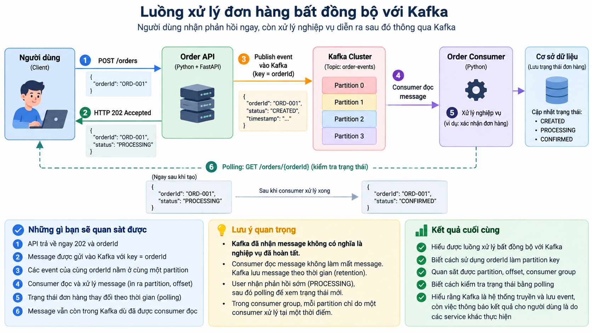
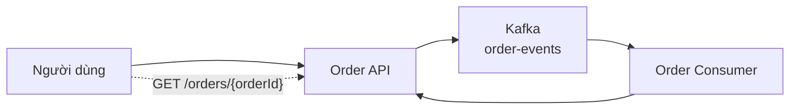
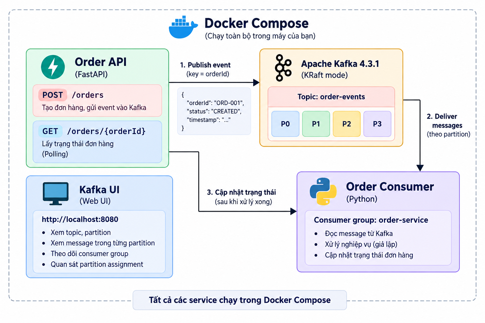
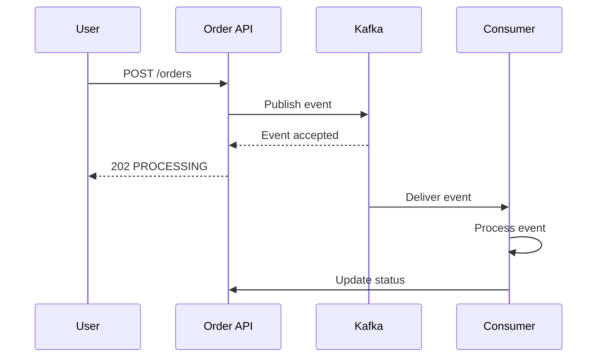
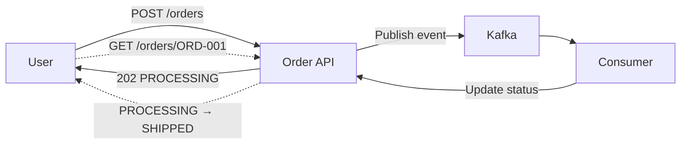
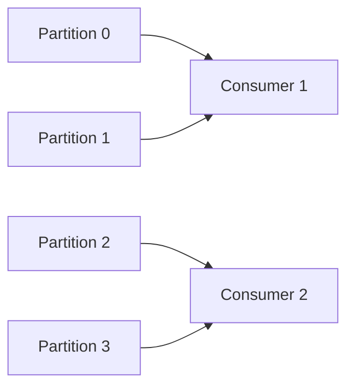

# Thực hành Kafka: Xử lý đơn hàng bất đồng bộ bằng Partition Key

## 1. Mục tiêu

Bài thực hành này dùng một hệ thống đơn hàng rất nhỏ để sinh viên quan sát Kafka hoạt động trong một luồng gần với hệ thống thực tế:



Sau bài, sinh viên cần thực hành và quan sát được:

- Message được API đưa vào Kafka.
- `orderId` được dùng làm Kafka message key/partition key.
- Các event của cùng một order đi vào cùng một partition.
- `offset` biểu diễn vị trí của message trong partition.
- Consumer đọc và xử lý message theo consumer group.
- Consumer đọc message không đồng nghĩa với Kafka xóa ngay message.
- Xử lý Kafka là bất đồng bộ: API có thể trả `PROCESSING` trước, sau đó client dùng polling để kiểm tra trạng thái.

Không yêu cầu sinh viên triển khai database, WebSocket, Kafka Streams, ZooKeeper hay cluster nhiều broker.

---

## 2. Bài toán

Một cửa hàng trực tuyến nhận nhiều đơn hàng. Mỗi đơn hàng có các event theo thời gian, ví dụ:

```text
ORD-001
   ↓
CREATED
   ↓
PAID
   ↓
SHIPPED
```

Hệ thống cần hai điều:

1. Nhiều đơn hàng khác nhau có thể được xử lý song song.
2. Các event của cùng một đơn hàng phải được xử lý theo đúng thứ tự.

Nếu hệ thống chỉ xử lý đồng bộ trong một request duy nhất, request phải chờ các công việc phía sau hoàn thành. Kafka cho phép tách việc **tiếp nhận event** khỏi việc **xử lý event**.

Luồng của bài:



### Điều người dùng nhận được

Khi tạo đơn, API không chờ consumer xử lý xong. API trả:

```json
{
  "orderId": "ORD-001",
  "status": "PROCESSING"
}
```

Sau đó client kiểm tra lại:

```text
GET /orders/ORD-001
```

cho đến khi trạng thái đã được consumer cập nhật.

### Điều cần phân biệt

```text
Kafka nhận message thành công
        ≠
nghiệp vụ đơn hàng đã hoàn thành
```

Consumer mới là thành phần lấy event ra và thực hiện xử lý nghiệp vụ trong bài lab.

---

## 3. Kiến trúc Docker của bài



Bài dùng Apache Kafka 4.3.1 ở KRaft mode, không dùng ZooKeeper. Apache Kafka hiện công bố image chính thức `apache/kafka:4.3.1`. Kafka UI dùng image `provectuslabs/kafka-ui:v0.7.2`. Xem nguồn ở cuối tài liệu.

---

## 4. Chuẩn bị môi trường ở nhà

### Yêu cầu

Sinh viên phải hoàn thành phần này **trước khi lên lớp**, vì bài được thiết kế để chạy không cần Internet sau khi các image đã được tải về.

Cần có:

- Docker Desktop.
- Docker Compose (đi kèm Docker Desktop hiện nay).
- Thư mục bài thực hành được chép sẵn trên máy.
- Đã chạy script chuẩn bị và kiểm tra lab thành công một lần.

### Windows PowerShell

Mở PowerShell tại thư mục bài và chạy:

```powershell
Set-ExecutionPolicy -Scope Process Bypass
.\PREPARE_OFFLINE.ps1
```

### Linux/macOS

```bash
chmod +x PREPARE_OFFLINE.sh
./PREPARE_OFFLINE.sh
```

Script sẽ:

1. Kiểm tra Docker.
2. Tải `apache/kafka:4.3.1`.
3. Tải `provectuslabs/kafka-ui:v0.7.2`.
4. Build image của ứng dụng Python.
5. Khởi động lab một lần để kiểm tra.
6. Dừng container nhưng giữ lại image và volume.

**Khi lên lớp không có Internet, không chạy `docker compose pull`.** Compose trong bài đã đặt `pull_policy: never` để tránh tự cố gắng tải image mới.

---

## 5. Khởi động bài thực hành

Từ thư mục gốc:

```bash
docker compose up -d
```

Kiểm tra:

```bash
docker compose ps
```

Các service chính cần chạy:

```text
kafka          Running
kafka-init     Exited (0)
api            Running
consumer       Running
kafka-ui       Running
```

`kafka-init` kết thúc với mã `0` là bình thường. Service này chỉ tạo topic một lần khi môi trường được khởi động.

Mở Kafka UI tại:

```text
http://localhost:8080
```

Mở API tại:

```text
http://localhost:8000/docs
```

---

# 6. Quan sát topic và partition

Topic của bài là:

```text
order-events
```

Topic có **4 partitions**:

```text
P0
P1
P2
P3
```

Có thể kiểm tra bằng Kafka UI, hoặc bằng CLI:

```bash
docker compose exec kafka /opt/kafka/bin/kafka-topics.sh \
  --describe \
  --topic order-events \
  --bootstrap-server kafka:9092
```

Sinh viên cần chụp **Minh chứng 1/2** trong `EVIDENCE.md`.

---

# 7. Message được tạo như thế nào?

Trong bài, **người dùng không gửi message trực tiếp vào Kafka**.

Người dùng gửi HTTP request đến Order API.

Ví dụ:

```http
POST /orders
```

với:

```json
{
  "orderId": "ORD-001"
}
```

API tạo Kafka event trong file `app/kafka_producer.py`.

Đoạn code quan trọng là:

```python
producer.produce(
    topic="order-events",
    key=order_id,
    value=json.dumps(event, ensure_ascii=False),
)
```

Ở đây:

```text
topic = order-events
key   = order_id
value = JSON event
```

Vì vậy với:

```text
orderId = ORD-001
```

thì Kafka key là:

```text
ORD-001
```

Đây chính là **partition key** mà bài đang quan sát.

> Trong ứng dụng thực tế, đoạn code gửi Kafka có thể nằm trực tiếp trong service/API nghiệp vụ. Trong bài lab, nó được tách thành `kafka_producer.py` để sinh viên dễ nhìn thấy trách nhiệm của từng file.

---

# 8. Tạo order đầu tiên

Dùng cURL hoặc công cụ tương đương.

### Windows PowerShell

```powershell
Invoke-RestMethod `
  -Method Post `
  -Uri http://localhost:8000/orders `
  -ContentType "application/json" `
  -Body '{"orderId":"ORD-001"}'
```

### Linux/macOS

```bash
curl -X POST http://localhost:8000/orders \
  -H "Content-Type: application/json" \
  -d '{"orderId":"ORD-001"}'
```

Kết quả có dạng:

```json
{
  "orderId": "ORD-001",
  "status": "PROCESSING",
  "eventId": "...",
  "message": "Order accepted and event published to Kafka."
}
```

### Điều cần hiểu

API đã nhận request và đã gửi event vào Kafka, nhưng **consumer chưa nhất thiết xử lý xong**.

Đây là bản chất của luồng bất đồng bộ:



Chụp **Minh chứng 3**.

---

# 9. Quan sát message trong Kafka UI

Mở:

```text
http://localhost:8080
```

Vào cluster `local` → topic `order-events` → messages.

Tìm event của `ORD-001`.

Sinh viên cần quan sát ít nhất:

```text
Key
Value
Partition
Offset
```

Ví dụ có thể thấy:

```text
Key:       ORD-001
Partition: 2
Offset:    0
Value:     {"orderId":"ORD-001", "status":"CREATED", ...}
```

**Số partition thực tế của `ORD-001` có thể không giống ví dụ trên.** Không được ghi cứng rằng `ORD-001` luôn ở P2; điều quan trọng là các message có cùng key của cùng order sẽ được Kafka đưa vào cùng partition trong cùng cấu hình partitioning.

---

# 10. Tạo thêm event cho cùng một order

Sau khi tạo `ORD-001`, tạo event `PAID`:

### PowerShell

```powershell
Invoke-RestMethod `
  -Method Post `
  -Uri http://localhost:8000/orders/ORD-001/events `
  -ContentType "application/json" `
  -Body '{"status":"PAID"}'
```

Tạo tiếp `SHIPPED`:

```powershell
Invoke-RestMethod `
  -Method Post `
  -Uri http://localhost:8000/orders/ORD-001/events `
  -ContentType "application/json" `
  -Body '{"status":"SHIPPED"}'
```

### Linux/macOS

```bash
curl -X POST http://localhost:8000/orders/ORD-001/events \
  -H "Content-Type: application/json" \
  -d '{"status":"PAID"}'

curl -X POST http://localhost:8000/orders/ORD-001/events \
  -H "Content-Type: application/json" \
  -d '{"status":"SHIPPED"}'
```

Bây giờ mở Kafka UI và quan sát ba event của `ORD-001`.

Mục tiêu là nhìn thấy:

```text
ORD-001 → CREATED  → Partition X → Offset n
ORD-001 → PAID     → Partition X → Offset n+1
ORD-001 → SHIPPED  → Partition X → Offset n+2
```

Ở đây có hai ý quan trọng:

- Cùng `orderId` → cùng partition.
- Trong cùng partition, offset tăng dần nên thứ tự event của order được bảo toàn.

Chụp **Minh chứng 4 và 5**.

---

# 11. Quan sát consumer

Xem log của consumer:

```bash
docker compose logs -f consumer
```

Có thể thấy dạng:

```text
[consumer] key=ORD-001 partition=2 offset=0 orderId=ORD-001 status=CREATED
[consumer] processed and committed orderId=ORD-001 offset=0

[consumer] key=ORD-001 partition=2 offset=1 orderId=ORD-001 status=PAID
[consumer] processed and committed orderId=ORD-001 offset=1

[consumer] key=ORD-001 partition=2 offset=2 orderId=ORD-001 status=SHIPPED
[consumer] processed and committed orderId=ORD-001 offset=2
```

Consumer đang cho chúng ta thấy trực tiếp:

```text
key       → partition key
partition → message nằm ở partition nào
offset    → vị trí của message trong partition
status    → nghiệp vụ đang xử lý
```

Chụp **Minh chứng 6**.

---

# 12. Polling: người dùng biết kết quả thế nào?

Vì xử lý Kafka là bất đồng bộ, request ban đầu không phải lúc nào cũng chờ đến khi nghiệp vụ hoàn thành.

Kiểm tra trạng thái:

```text
GET http://localhost:8000/orders/ORD-001
```

Ví dụ trước khi consumer xử lý xong:

```json
{
  "orderId": "ORD-001",
  "status": "PROCESSING"
}
```

Sau khi consumer xử lý:

```json
{
  "orderId": "ORD-001",
  "status": "SHIPPED"
}
```

Ta có luồng:



Trong bài lab, chúng ta dùng **polling** để minh họa cách đơn giản nhất. Hệ thống thực tế cũng có thể dùng WebSocket/SSE hoặc notification service, nhưng không cần triển khai các cơ chế đó trong bài này.

Chụp **Minh chứng 7**.

---

# 13. Consumer đọc message có làm mất message không?

**Không.** Consumer đọc message không có nghĩa Kafka lập tức xóa message đó.

Kafka lưu message trong partition theo chính sách retention. Consumer group dùng offset để ghi nhớ vị trí đã đọc.

Có thể hình dung:

```text
Partition 2

offset 0 → CREATED
offset 1 → PAID
offset 2 → SHIPPED
             ↑
       consumer đã đọc
```

Dù consumer đã đọc, message vẫn có thể quan sát trong Kafka UI cho đến khi chính sách retention cho phép xóa.

Bài lab đặt retention 7 ngày để việc quan sát dễ dàng.

Chụp **Minh chứng 8** bằng Kafka UI sau khi consumer đã xử lý message.

---

# 14. Vì sao cần consumer group?

Trong bài, consumer dùng:

```text
group.id = order-service
```

Kafka có 4 partition:

```text
P0  P1  P2  P3
```

Nếu có hai consumer cùng thuộc `order-service`, Kafka có thể chia các partition giữa chúng:



Đây chỉ là **một ví dụ về assignment**; Kafka có thể phân công khác tùy thời điểm.

Điều sinh viên cần hiểu là:

> Trong cùng một consumer group, các partition được chia cho các consumer để xử lý song song. Một partition không đồng thời được xử lý bởi hai consumer của cùng group tại cùng một thời điểm.

### Thực hành thêm consumer thứ hai

Mở terminal thứ nhất:

```bash
docker compose logs -f consumer
```

Mở terminal thứ hai và chạy thêm một container consumer cùng group:

```bash
docker compose run --rm consumer python consumer.py
```

Quan sát log của hai consumer. Nếu cần quan sát lại từ đầu, hãy tạo dữ liệu mới hoặc reset lab theo phần bên dưới.

Chụp **Minh chứng 9**.

---

# 15. Nếu muốn quan sát rõ lại từ đầu

Bài lab có volume lưu dữ liệu Kafka. Khi cần làm lại hoàn toàn:

```bash
docker compose down -v
```

Sau đó:

```bash
docker compose up -d
```

Lệnh `down -v` sẽ xóa volume của Kafka nên các topic, message và offset trong môi trường lab sẽ được tạo lại từ đầu.

---

# 16. Công cụ tạo dữ liệu nhanh

File `app/send_demo.py` chỉ là **client tiện ích để tạo dữ liệu**, không phải thành phần đặc biệt của Kafka.

Nó gọi API:

```text
POST /orders
POST /orders/{orderId}/events
```

Ví dụ chạy từ host nếu máy đã có Python:

```bash
python app/send_demo.py ORD-100
```

Script sẽ gửi:

```text
ORD-100 → CREATED
ORD-100 → PAID
ORD-100 → SHIPPED
```

Trong bài chính, nên thực hiện ít nhất một lần bằng HTTP request thủ công để thấy rõ API là nơi tạo event. Script chỉ giúp tạo thêm dữ liệu nhanh để quan sát.

---

# 17. Những file quan trọng trong bài

```text
kafka-order-lab/
├── docker-compose.yml
├── README.md
├── EVIDENCE.md
├── PREPARE_OFFLINE.ps1
├── PREPARE_OFFLINE.sh
├── app/
│   ├── Dockerfile
│   ├── requirements.txt
│   ├── api.py
│   ├── kafka_producer.py
│   ├── consumer.py
│   └── send_demo.py
└── docs/
    └── images/
        ├── kafka-partition-flow.png
        └── async-order-flow.png
```

### `api.py`

Nhận HTTP request và trả trạng thái cho client.

### `kafka_producer.py`

Tạo event và gửi event vào Kafka; `orderId` được dùng làm key.

### `consumer.py`

Đọc event từ Kafka, in `key/partition/offset`, mô phỏng xử lý và cập nhật trạng thái về API; offset chỉ được commit sau khi xử lý thành công.

### `send_demo.py`

Client tiện ích để tạo nhiều event nhanh.

---

# 18. Minh chứng cần nộp

Sinh viên sử dụng `EVIDENCE.md` làm checklist. Bộ minh chứng tối thiểu gồm:

```text
01-docker-running.png
02-topic-4-partitions.png
03-api-202-processing.png
04-same-order-same-partition.png
05-offset-ordering.png
06-consumer-partition-offset.png
07-polling-status.png
08-message-still-in-kafka.png
09-consumer-group.png
```

Tên file có thể thay đổi, nhưng nội dung cần chứng minh phải tương ứng với checklist.

---

# 19. Sau khi thực hành, chỉ cần nhớ

```text
User
  ↓
API
  ↓
Kafka
  ↓
Topic
  ↓
Partition
  ↓
Consumer
  ↓
Cập nhật trạng thái
  ↓
User polling
```

Và với bài toán đơn hàng:

```text
orderId
   ↓
Kafka message key
   ↓
Partition
   ↓
Giữ thứ tự event của order
```

Kafka không xóa message chỉ vì consumer đã đọc; consumer group dùng offset để ghi nhớ vị trí đã xử lý.

---

# 20. Câu hỏi cuối bài

1. Vì sao `orderId` được dùng làm partition key?
2. Khi consumer đọc message, Kafka có xóa ngay message đó không?
3. `partition` và `offset` cho biết điều gì trong log consumer?
4. Vì sao API có thể trả `PROCESSING` rồi người dùng kiểm tra lại bằng polling?

Chỉ cần giải thích được bốn câu hỏi trên bằng chính kết quả quan sát được trong bài là đạt mục tiêu thực hành.

---

## Nguồn tham khảo

- Apache Kafka 4.3.1 Downloads: https://kafka.apache.org/community/downloads/
- Apache Kafka 4.3 Docker documentation: https://kafka.apache.org/43/getting-started/docker/
- Apache Kafka Quickstart: https://kafka.apache.org/quickstart/
- UI for Apache Kafka / Kafka UI: https://github.com/provectus/kafka-ui
